# Internet Cafe Food Management
## Overview

The **Web Food Net** project is an admin dashboard for managing food categories, products, and orders. It includes functionalities to generate reports, manage categories, view products, and handle orders. 
The back-end is developed using **ASP.NET Core MVC**, 
while the front-end uses **HTML**, **CSS**, **JavaScript**, and **Bootstrap** for a responsive user interface.

## Key Features
- **BaoCao (Reports):** Generate reports for categories, products, and sales.
- **DanhMuc (Categories):** Manage categories and fetch category-related data.
- **MatHang (Products):** Manage and display products.
- **DonHang (Orders):** View and filter orders by date range and product.
  
## API Endpoints
- **GetCategories:** Fetches a list of food categories.
- **GetProducts:** Retrieves a list of products.
- **GetReportCat:** Generates reports for categories.
- **GetReportFnb:** Generates product-related reports.
- **GetReportFnbByCatId:** Fetches reports for products filtered by category.
- **GetSaleReport:** Provides a general sales report.
- **GetOrder:** Retrieves order data.
- **GetOrdersByDateRange:** Fetches orders within a specific date range.
- **GetOrderByFnbId:** Retrieves orders for a specific product.

## Technologies Used

- **Back-End:** ASP.NET Core MVC
- **Front-End:** HTML, CSS, JavaScript, Bootstrap
- **Database:** Microsoft SQL Server

## Setup and Installation

1. Clone this repository to your local machine.
  ```bash
   git clone --branch feat_dhang_mhang_nmhang https://github.com/LeThiHongNgot/Web_Food_Net.git
   ``` 
2. Install the required dependencies using:
   ```bash
   # Bootstrap (frontend package via NuGet)
   dotnet add package bootstrap --version 5.3.2

   # Entity Framework Core packages
   dotnet add package Microsoft.EntityFrameworkCore --version 6.0.25
   dotnet add package Microsoft.EntityFrameworkCore.SqlServer --version 6.0.25
   dotnet add package Microsoft.EntityFrameworkCore.Tools --version 6.0.25

   dotnet add package Microsoft.AspNetCore.Mvc
   dotnet add package Microsoft.AspNetCore.Mvc.Razor.RuntimeCompilation
   ```
3. Configure your database connection in the appsettings.json file:
  ```bash
  "ConnectionStrings": {
    "QLNet": "Data Source=.\\SQLEXPRESS;Initial Catalog=QLNet;Integrated Security=True"
  }
  ```
4. Run the application:
  ```bash
  dotnet run
  ```

## Usage
- After the application starts, you can access the admin dashboard in your browser at:
```bash
  http://localhost:5000
```
- The dashboard will allow you to:
  - View and manage food categories and products.
  - Generate and view various reports related to categories, products, and sales.
  - Filter orders by date range and product.

## Project Features

### Dashboard View
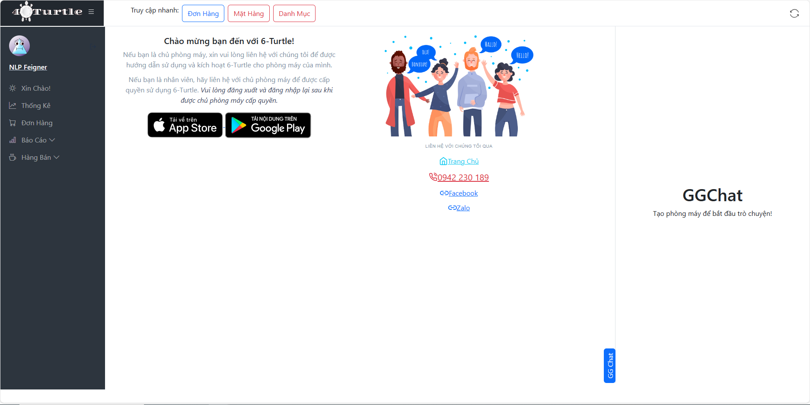

### View All Orders
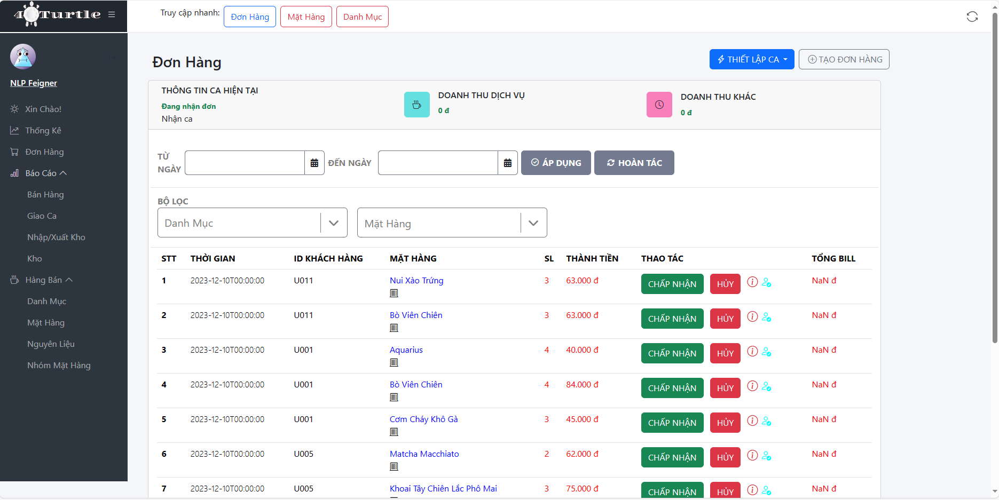

### Add Order
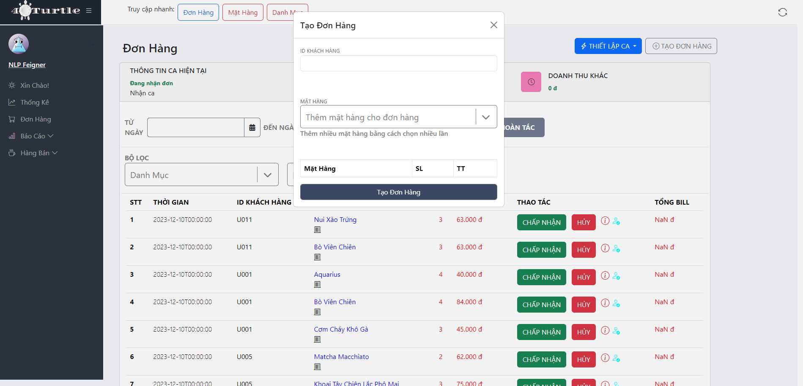

### View All Products
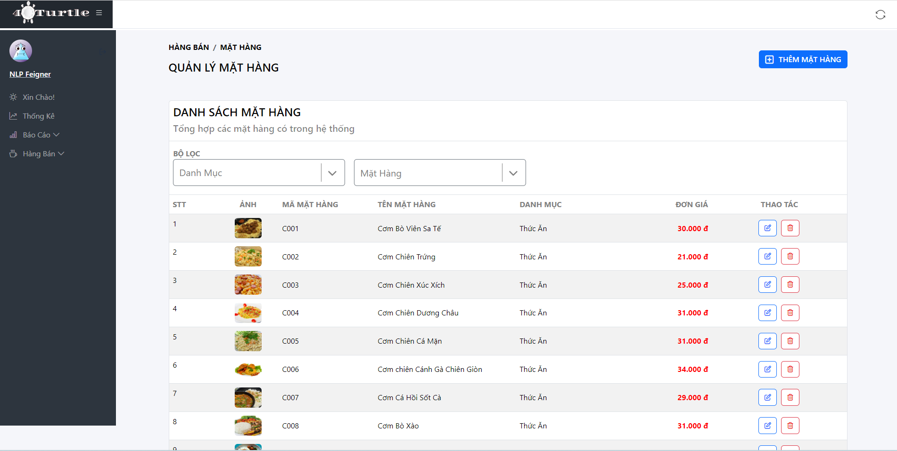

### Add Product
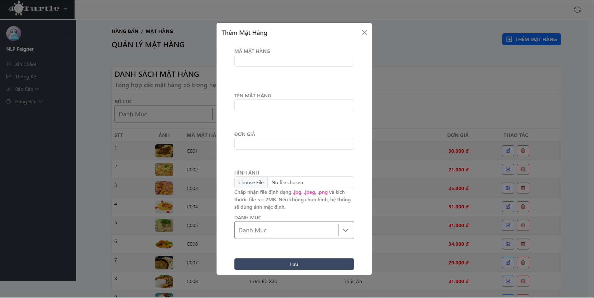

### Update Product
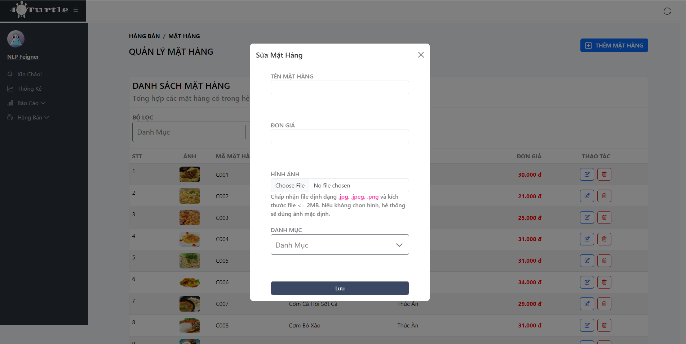

### Delete Product
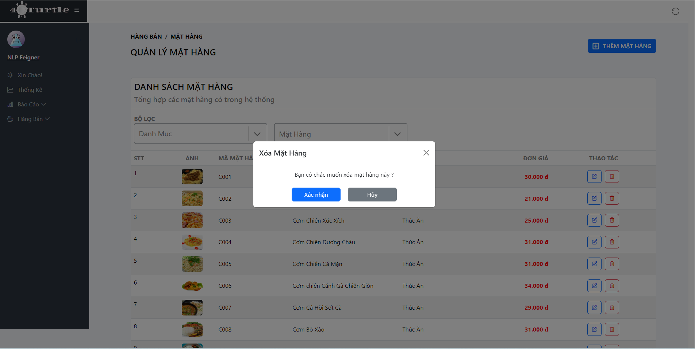

### View All Categories
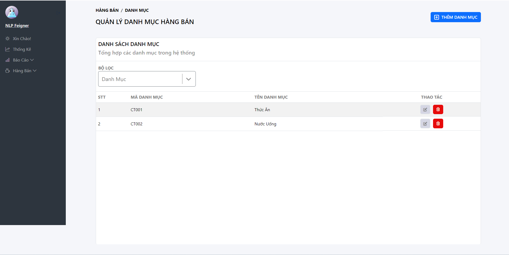

### Add Category
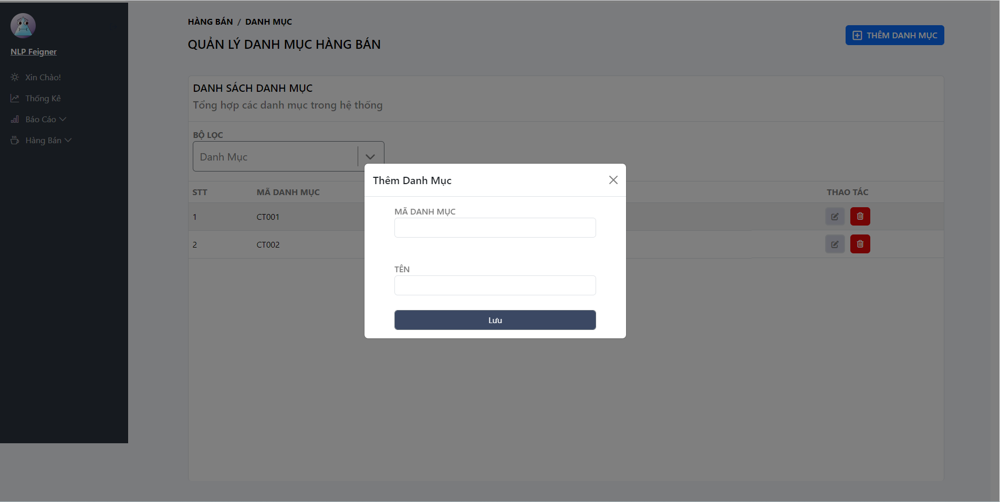

### Update Category
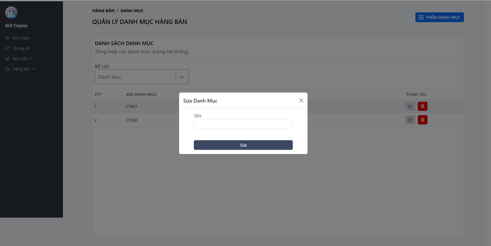

### Delete Category
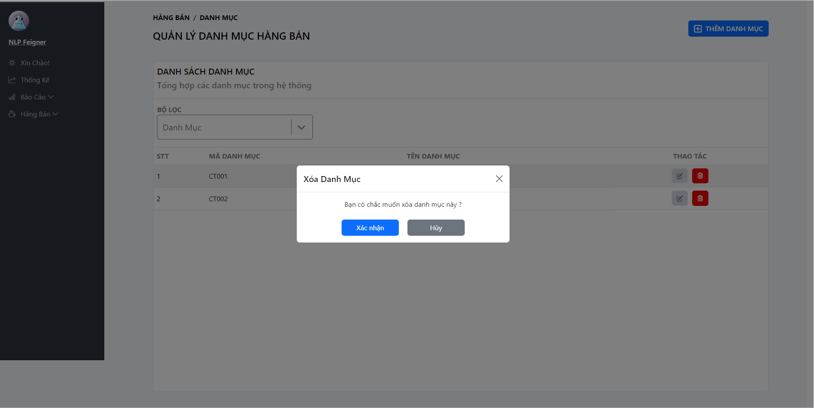

### View Report
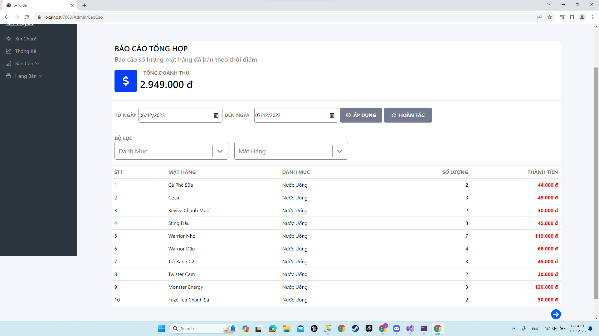
